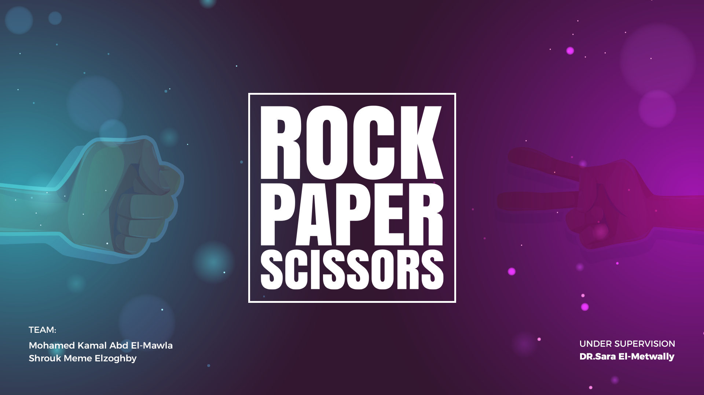
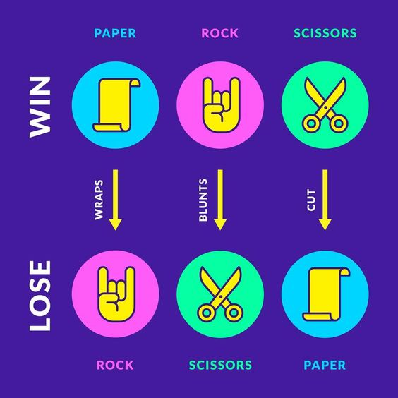
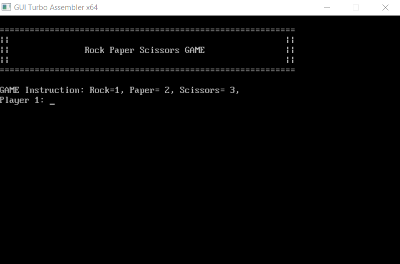
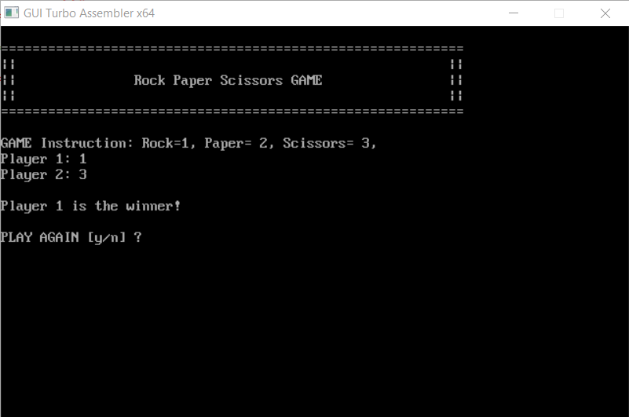
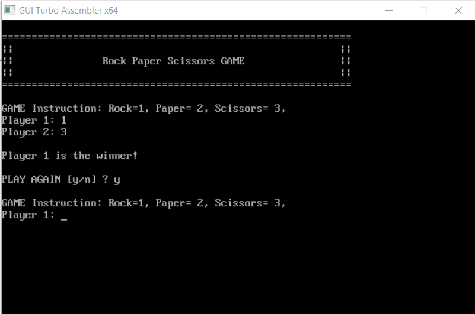
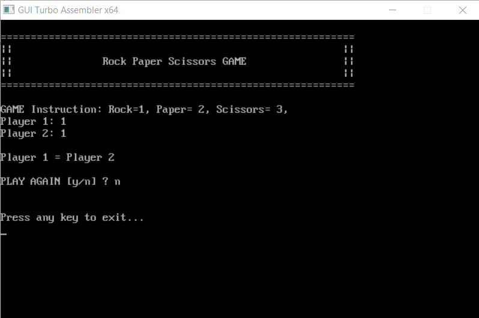

# RPS-GAME-ASSEMBLY
Rock-Paper-Scissors Game in Assembly language 8086

## Gameplay

1. The game will prompt the first player to input their choice (rock=1, paper=2, or scissors=3).
2. The computer will uses the system time to generate a random number (from 1-3 )as a player 2
3. The program will determine the winner based on the traditional rules of the game:
   - Rock crushes scissors.
   - Scissors cuts paper.
   - Paper covers rock.
4. The winner will be displayed on the screen.
5. Then ask you if you want to play again or not.

## Game Rules

## Final Product

